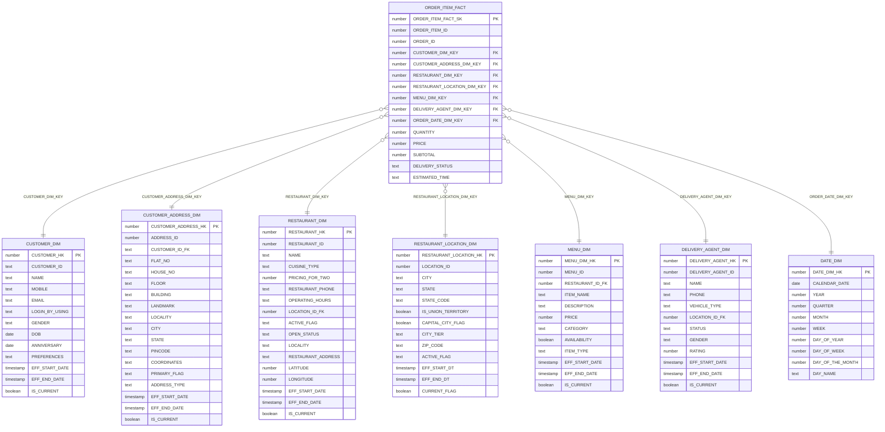

# Food Aggregator — ER Diagram (CONSUMPTION_SCH Star Schema)

Central fact `ORDER_ITEM_FACT` (grain: one row per order item) linked to 7 SCD-style
dimensions via surrogate hash keys (`*_HK`).

## Relationships

| Fact FK column                | References dimension        | On (hash key)             |
|-------------------------------|-----------------------------|---------------------------|
| CUSTOMER_DIM_KEY              | CUSTOMER_DIM                | CUSTOMER_HK               |
| CUSTOMER_ADDRESS_DIM_KEY      | CUSTOMER_ADDRESS_DIM        | CUSTOMER_ADDRESS_HK       |
| RESTAURANT_DIM_KEY           | RESTAURANT_DIM              | RESTAURANT_HK             |
| RESTAURANT_LOCATION_DIM_KEY  | RESTAURANT_LOCATION_DIM     | RESTAURANT_LOCATION_HK    |
| MENU_DIM_KEY                 | MENU_DIM                    | MENU_DIM_HK               |
| DELIVERY_AGENT_DIM_KEY       | DELIVERY_AGENT_DIM          | DELIVERY_AGENT_HK         |
| ORDER_DATE_DIM_KEY           | DATE_DIM                    | DATE_DIM_HK               |

Notes:
- Dimensions are SCD-tracked (`EFF_START/END`, `IS_CURRENT` / `CURRENT_FLAG`).
- FK constraints in Snowflake are informational (not enforced).
